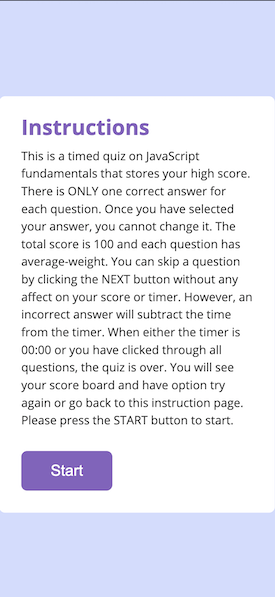
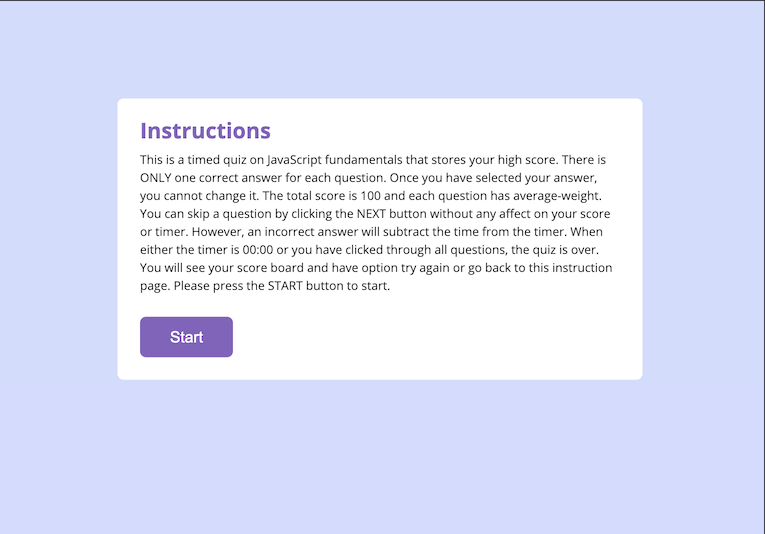

# Timed Quiz APP 

### Table of Content
1. [Project Context - User Story](#context)
2. [ Project Objectives ](#objectives)
3. [ Outcome ](#Outcome)
4. [ Project Links ](#Links)
5. [ Screenshots ](#Screenshots)
6. [Pseudocode - Logic Steps](#Pseudocode)
7. [ Installation](#Installation)
8. [ Credits](#Credits)
9. [What I've Learned](#learned)
10. [ License ](#License)
#

### 1. Project Context - User Story
* A coding bootcamp student takes a timed quiz on JavaScript fundamentals that stores high scores to gauge his/her progress compared to other peers. 
* When the start button is clicked, the timer starts and the user will be presented with a question. When a question is answered, the user will be presented with another question. 
* When a question is answered incorrectly, the time is subtracted from the clock. 
* When all questions are answered, or the timer reaches 0, then the quiz is over. 
* The user can save his/her initials and score. 

### 2. Project Objectives
* Build a timed code quiz that meets the above user story with multiple-choice questions and interactive challenges. 
* This app will run in the browser and feature dynamically updated HTML and CSS powered by JavaScript code. 
* The password is either displayed in an alert or written to the page
* It will also feature a clean and polished user interface and be responsive, ensuring that it adapts to multiple screen sizes.

### 3. Outcome
* The user interface is responsive to different devices - mobile, tablets, laptops and larger screen desktops
* The timer counts down with penalty for wrong answers 
* The high score is saved 

### 4. Links 

#### Link to Website
 https://imbingz.github.io/Timed-Quiz-App/

#### Link to Files 
https://github.com/imbingz/Timed-Quiz-App

### 5. Screenshots 

#### Screenshots - Mobile View
<kbd></kbd>

####  Screenshots - Laptop view 
<kbd></kbd>

### 6. Pseudocode - Logic Steps
* Create an event handler for the start button. 
  * When the button is licked, the timer will start to count down 
  * When the button is clicked, the question will be displayed with answer options, the start button will disappear from screen. 
* When the queston is answered, another question with answer options will be presented
* If the answer is wrong, time will be subtracted from the timer as penalty. 
* When all the questions are answered, or timer is 0, whichever happens sooner, the quiz is over. 
* Compare score of each play and store the high score along with initials.
* Display the high score to user without displaying questions/options and start button. 
* User has options to try again or back to homepage. 

### 7. Installation
* Access to GitHub.com and a code editor such as vscode is necessary
* Go to [github.com/imbingz/imbingz.github.io.](https://github.com/imbingz/Timed-Quiz-App)
* Click on the green button that says Clone or Download
* Choose how you would like to download: using the SSH/HTTPS keys or download the zip file
* Using SSH/HTTPS Key: You will copy the link shown and open up either terminal (mac: pre-installed) or gitbash (pc: must be installed). Once the application is open, you will type git clone paste url here. Once you have cloned the git repo, cd into the repo and type open. to open the folder which contains all files used for the website. Once inside the folder, click on index.html to open the website in the browser.
* Using Download ZIP: Click on Download Zip. Locate the file and double click it to unzip the file. Locate the unzipped folder and open it. All the files for the website will be within this folder. Click on index.html to open the website in the browser.
* If you like to test this Password Generator App, please click the link [here](https://imbingz.github.io/Timed-Quiz-App/)

### 8. Credits:
I would like to express my gratitude to the following parties without whom I would not have possibly completed this project as is. 

* [CSS reset style sheet https://meyerweb.com](https://meyerweb.com/eric/tools/css/reset/)
* [Quiz Bank - W3 School JavaScript Quiz Test www.w3schools.com](https://www.w3schools.com/quiztest/quiztest.asp?qtest=JS)
* [CSS reset style sheet https://meyerweb.com](https://meyerweb.com/eric/tools/css/reset/)
* [Ui/Ux Case Study: A Quiz app- www.medium.com](https://medium.com/@dipupo8/ui-ux-case-study-a-quiz-app-chemquiz-19bde71cb837)
* [Quiz UI Research - www.proprofs.com](https://www.proprofs.com/quiz-school/story.php?title=introduction-to-web-development-quiz)
* [::before and ::after CSS pseudo elements - www.bryanlrobinson.com](https://bryanlrobinson.com/blog/top-3-uses-of-after-and-before-css-pseudo-elements/)
* [Quiz UI Inspiration - www.behance.net](https://www.behance.net/gallery/91221621/Game-Quiz-A-game-app-concept)

W3 validator 

### 9. What I've Learned
* 
* 
* 
*
* 
* 

### 10. License
##### MIT License

Copyright (c) [2020] [bingzhang]

Permission is hereby granted, free of charge, to any person obtaining a copy of this software and associated documentation files (the "Software"), to deal in the Software without restriction, including without limitation the rights to use, copy, modify, merge, publish, distribute, sublicense, and/or sell copies of the Software, and to permit persons to whom the Software is furnished to do so, subject to the following conditions:

The above copyright notice and this permission notice shall be included in all copies or substantial portions of the Software.

THE SOFTWARE IS PROVIDED "AS IS", WITHOUT WARRANTY OF ANY KIND, EXPRESS OR IMPLIED, INCLUDING BUT NOT LIMITED TO THE WARRANTIES OF MERCHANTABILITY, FITNESS FOR A PARTICULAR PURPOSE AND NON-INFRINGEMENT. IN NO EVENT SHALL THE AUTHORS OR COPYRIGHT HOLDERS BE LIABLE FOR ANY CLAIM, DAMAGES OR OTHER LIABILITY, WHETHER IN AN ACTION OF CONTRACT, TORT OR OTHERWISE, ARISING FROM, OUT OF OR IN CONNECTION WITH THE SOFTWARE OR THE USE OR OTHER DEALINGS IN THE SOFTWARE.

August 15, 2020.

